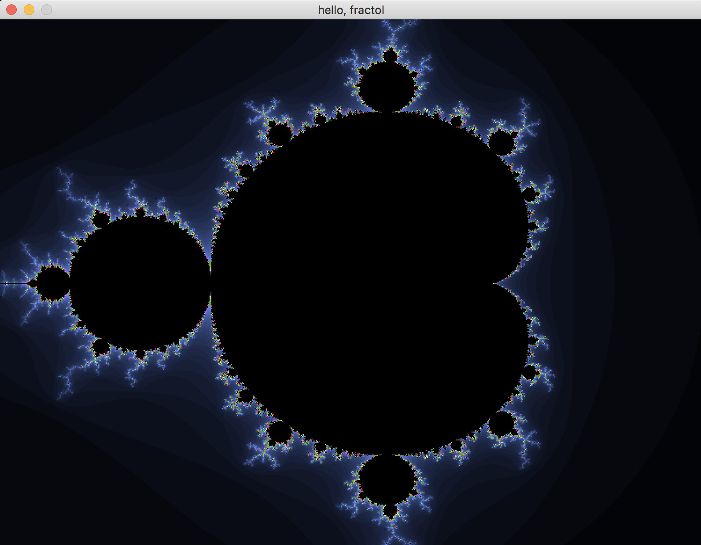
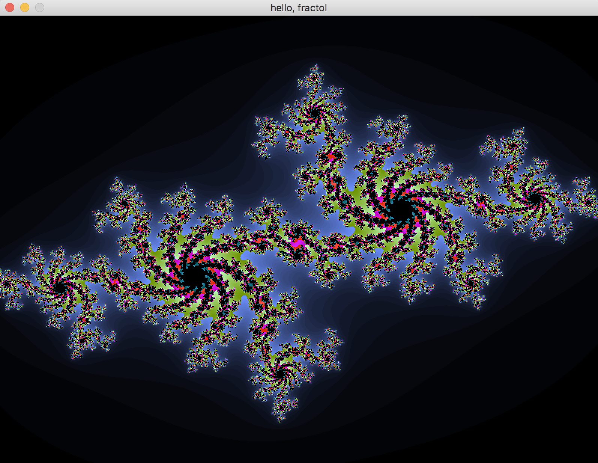

# FRACTOL
This project is meant to create graphically beautiful fractals.

### Burning Ship fractal:

### Burning Ship fractal #2:

### Mandelbrot set:

### Mandelbrot set #2:

### Julia set:

### Julia set #2:

#### Links
* [List of fractals by Hausdorff dimension](https://en.wikipedia.org/wiki/List_of_fractals_by_Hausdorff_dimension)
* [Mandelbrot set](https://en.wikipedia.org/wiki/Mandelbrot_set)
* [Burning Ship fractal](https://en.wikipedia.org/wiki/Burning_Ship_fractal)
* [Coding Challenge #21: Mandelbrot Set with p5.js](https://youtu.be/6z7GQewK-Ks) - The Coding Train, YouTube
* [Coding Challenge #22: Julia Set in Processing](https://youtu.be/fAsaSkmbF5s) - The Coding Train, YouTube

